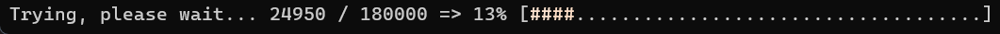
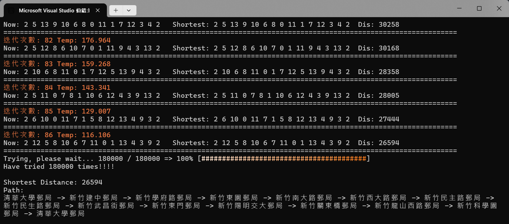
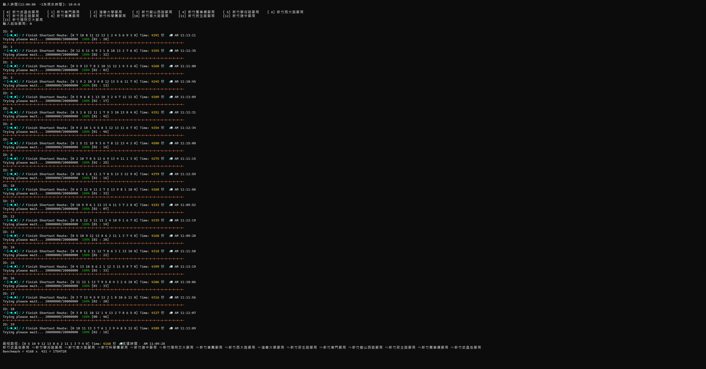
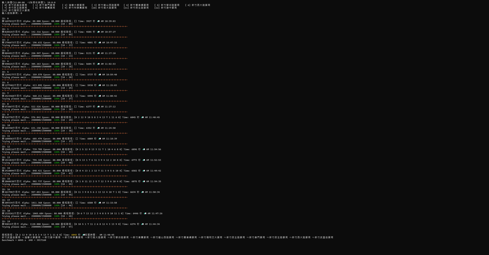

# 必備檔案

- [httplib.h](https://github.com/yhirose/cpp-httplib)
- [json.hpp](https://github.com/nlohmann/json/blob/develop/single_include/nlohmann/json.hpp)
- google_map.hpp
- libcrypto-3-x64.dll
- libssl-3-x64.dll
- post_office.json

> [!IMPORTANT]
> 本次 project 使用到 Google 的**_Distance Matrix API_**，與 Google API 傳送請求需要 OpenSSL，因此請參閱[下載 OpenSSL for Win](https://blog.csdn.net/m0_46665077/article/details/125609435)與[OpenSSL VS 配置教學](https://blog.csdn.net/m0_51531114/article/details/132207881) (若依照教學在 lib 的配置中需包含資料夾到 MD)
>
> 

# 操作指南

### _post_office.json_

裡面有以下內容：

```json
"post_office":[
{
    "index": 0,
    "loc": "place_id:ChIJb2HleAc1aDQRNgCqh8u6PU4",
    "name": "新竹武昌街郵局",
    "zip_code": "300191"
}
],
"time_stamp":1723097571
```

- `index`: 代表郵局編號
- `loc`: 郵局的 place id
- `name`: 郵局的名稱
- `zip_code`: 郵遞區號
- `time_stamp`: 取得資料的時間 (unix timestamp)
  > [!TIP]
  > 查詢 place id 網址: [Place ID](https://developers.google.com/maps/documentation/places/web-service/place-id?hl=zh-tw)

裡面的郵局資料都能繼續增加，用以上格式填寫，`index`需照順序填寫

> [!NOTE]
> 現有的資料中包含新竹市東區所有郵局
>
> 參見：[新竹市當地支局](https://subservices.post.gov.tw/post/internet/Q_localpost/index.jsp?ID=12070201&search_area=%E6%96%B0%E7%AB%B9%E5%B8%82&desc=lp004_06.htm#list)

### _post_office_with_info.json_

比 _post_office.json_ 多了 info 資訊，巨集[`SAVE_MONEY`](#save_money)與[`SAVE_SAVE_MONEY`](#save_save_money)會用到

### _google_map.hpp_

> [!IMPORTANT]
> 需搭配 **_post_office.json_** 使用

### 使用方法

首先創建 _g_map_ 實例，他就會自動與 Google API 連線，各郵局對其他郵局的相對距離儲存於 _g_map_ 中的 pfs，形式為 `unordered_map <int, post_office>`

```cpp
g_map gm;
unordered_map<int, post_office> pfs = gm.pfs;
```

> [!NOTE]
> 詳細資料結構請在 _google_map.hpp_ 中的 `struct post_office` 查看

其中因為有 overloading operator << 所以可以輸出如下結果

```cpp
g_map gm;
cout << gm;

/*************** Output Result ****************

資料取得時間: 2024/08/08 Thursday 22:18:06

Start: 新竹武昌街郵局
新竹東門郵局: 1075 公尺 Time: 248 s
清華大學郵局: 3479 公尺 Time: 422 s
新竹龍山西路郵局: 5166 公尺 Time: 695 s
新竹關東橋郵局: 6072 公尺 Time: 814 s
新竹學府路郵局: 2770 公尺 Time: 327 s
新竹西大路郵局: 2214 公尺 Time: 422 s
新竹民主路郵局: 1517 公尺 Time: 306 s
新竹東園郵局: 2743 公尺 Time: 346 s
新竹科學園郵局: 6041 公尺 Time: 765 s
新竹南大路郵局: 3533 公尺 Time: 653 s
新竹民生路郵局: 668 公尺 Time: 113 s
新竹建中郵局: 3137 公尺 Time: 405 s
新竹陽明交大郵局: 5258 公尺 Time: 672 s
------------------------------------------
**********************************************/
```

### 內建巨集

#### `API_KEY`

每次發送請求都需要 API Key，因此**一定**要填，不然需要定義`SAVE_SAVE_MONEY`

> [!TIP] >[申辦方法](https://ithelp.ithome.com.tw/articles/10283037)

#### `SAVE_MONEY`

因為 Google API 不是完全免費，1 個月有**200 美金**免費額度，但此 project 一次發送的請求不少，而且計費是以[element](https://developers.google.com/maps/documentation/distance-matrix/usage-and-billing?hl=zh-tw)計費，因此`SAVE_MONEY`會檢查現在距離上次得到資料的時間是否超過`REQ_DUR`，超過則發送請求，若無則使用 _post_office_with_info.json_ 的資料

#### `SAVE_SAVE_MONEY`

> [!CAUTION]
> 一定要有 **_post_office_with_info.json_** 在資料夾中，不然就會強制連線

如果完全不想連接 Google API，那使用`SAVE_SAVE_MONEY`就只會使用現有資料( _post_office_with_info.json_ )

#### `REQ_DUR`

判斷是否要重新連線取得資料的時間長度

## 模擬退火演算法 (SA)

介紹影片
[](https://www.youtube.com/watch?v=P4p-YgidpZ4)

影片中有詳細解釋演算法如何運作，作法也有提供，照著做應該就能做出來

我自己的版本在 _PostOffice_project.cpp_ 中，裡面可以調整以下參數：

- `T0` : 初始溫度
- `iter` : 迭代次數上限
- `TRY_MAX` : 嘗試次數上限

現在結束演算法的方式是達到**迭代次數上限**或**嘗試次數上限**，每次迭代都會顯示如下資訊：

迭代次數: 0 Temp: 1000000.000

Now: 2 0 1 3 4 5 6 7 8 9 10 11 12 13 2 Shortest: 2 0 1 3 4 5 6 7 8 9 10 11 12 13 2 Dis: 45349

==============================================================================================================

嘗試次數圖例：



最終結果：



> [!TIP]
> 如果只想運行退火演算法請 `#define SA`，想用窮舉驗證請 `#define PROOF`，兩者可同時開啟

### 改善方向
+ 用窮舉驗證14個郵局，不包刮起終點郵局有 ***13\!*** 的組合，即 **6,227,020,800** 種組合，單線程要全部算完要花大約1個月的時間，建議改方法或開多點線程加速
+ SA算法有許多變數，初始溫度、降溫函式、機率函數、篩選函數等都會影響，要多試幾種才能找到較好的
+ 現在隨機數的搭配是 *mt19937* 與 *uniform_real_distribution (連續型均勻分布)* 可以搭配其他種試試
+ 結束的條件也會影響結果，能試其他結束條件

### Screen Shot
#### v1.1
***C++***

#### v2.0
***C++***

***Go***

#### v3.0
***Go***



# 版本紀錄

## v1.0

包含操作指南全部，可直接連 Google API 獲得位置與時間資訊

## v1.1

- 路徑的單位由**公尺**改為**秒**
<<<<<<< HEAD
- 計算時間方式 -> 記錄各動作時間，時間加總至下一小時會用下一小時資料 ex. 現在時間 9:57，用 9 點的 data，到下一地點時間變為 10:05，會用 10 點的 data 來計算時間
- 新增 data 資料夾，包含早上 9 點至下午 5 點資料
- 移動路徑的選擇方式由 shuffle 改至 swap，並且根據最短路徑 swap，但還是可選擇 shuffle
=======
- 計算時間方式 -> 記錄各動作時間，時間加總至下一小時會用下一小時資料 ex. 現在時間9:57，用9點的data，到下一地點時間變為10:05，會用10點的data來計算時間
- 新增data資料夾，包含早上9點至下午5點資料
- 移動路徑的選擇方式由shuffle改至swap，並且根據最短路徑swap，但還是可選擇shuffle

## v2.0
- 增加多線程並行運算方式
- 並行運算為每個thread各自運行SA，最終在全部thread中挑選出最短距離
- 增加新語言 **Go**
## v3.0
- 演算法換為**SQA** (模擬量子退火)
- 新增Becnchmark，計算方式為 ***最短旅行時間 x 演算法執行時間*** (v1.1 ~ v3.0皆添加)
>>>>>>> d0a395c71820c4dd07032b69227141d5fa45dc0f
